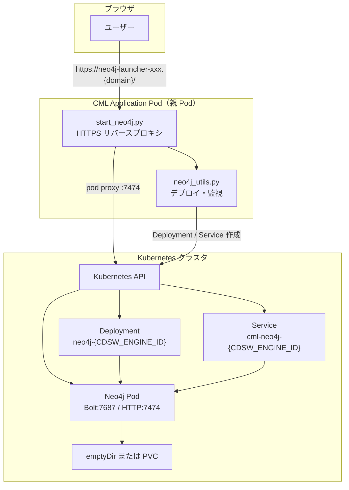

# Neo4j Launcher

Cloudera Machine Learning（CML）上で Neo4j を Kubernetes にデプロイし、**CML Application の HTTPS URL 経由で Neo4j Browser を使える**ようにする AMP です。

Neo4j の起動・監視と、Browser / Query API 向けのリバースプロキシを提供します。

## 概要

- Neo4j 2026.x を Kubernetes Deployment として起動（デフォルト: `neo4j:2026.07.1`）
- CML Application URL 経由で Neo4j Browser と HTTPS Query API に接続
- 子 Neo4j Pod への HTTP 通信は Kubernetes API の pod proxy 経由（CML NetworkPolicy 対策）
- LoadBalancer / NodePort / ClusterIP で Bolt・HTTP をクラスタ外にも公開（任意）
- 起動後はヘルスチェックと自動再起動（30 秒間隔）

プラグイン（APOC / GDS など）と PVC 永続化は**任意**です。初回起動の安定性のため、デフォルトではプラグインなし・emptyDir（非永続）で起動します。

## アーキテクチャ

CML Application Pod（親）内の Python プロセスが Kubernetes API を呼び出し、別の Neo4j Pod（子）をデプロイします。ブラウザからのリクエストは親 Pod 上の HTTP サーバーが受け取り、子 Neo4j Pod にプロキシします。



### 主なコンポーネント

| コンポーネント | 説明 |
|---|---|
| CML Application Pod | `start_neo4j.py` が `CDSW_APP_PORT` で HTTP サーバーを起動し、Neo4j のデプロイ・監視をバックグラウンドで実行 |
| Deployment | Neo4j コンテナを 1 レプリカで起動（UID/GID 7474） |
| Service | Bolt（7687）と HTTP（7474）を公開。デフォルトは LoadBalancer |
| データ volume | デフォルトは emptyDir（非永続）。`NEO4J_USE_PVC=true` でプロジェクト PVC を使用 |

### HTTP エンドポイント（Application URL 上）

| パス | 説明 |
|---|---|
| `/` | Neo4j HTTP 準備完了時は Browser にリダイレクト。起動中はステータスページ。API クライアント向けには discovery JSON を返す |
| `/launcher` | デプロイ状況・接続情報のステータスページ（10 秒ごとに自動更新） |
| `/launcher/discovery` | Neo4j Browser 用の discovery JSON（CML プロキシ URL に書き換え済み） |
| `/browser/` | Neo4j Browser（プロキシ経由） |
| `/health` | CML ヘルスチェック用（`ok` を返す） |

## セットアップ

### AMP タスク

1. **Install Dependencies** — `kubernetes`, `neo4j` パッケージをインストール
2. **Neo4j Launcher** — Neo4j を起動し、HTTP サーバーとステータスページを公開

`.project-metadata.yaml` では Application に CPU 2・メモリ 8GB が指定されています。

### CML Application のリソース

Launcher（親 Pod）と Neo4j Pod（子 Pod）は同じノード上で並行動作します。**CML Application にはメモリ 8GB・CPU 2 以上**を割り当てることを推奨します。親 Pod のメモリが 4GB のままだと、子 Pod（`NEO4J_MEMORY=4Gi`）と合わせてノード上限を超え、OOMKilled になることがあります。

### 環境変数（任意）

CML の Configuration 画面で空欄にした変数は空文字として渡されることがありますが、本プロジェクトは空文字をデフォルト値として扱います。

| 変数 | デフォルト | 説明 |
|------|-----------|------|
| `NEO4J_USERNAME` | `neo4j` | Neo4j ユーザー名 |
| `NEO4J_PASSWORD` | `Neo4jPass1234` | パスワード。未設定時は `neo4j` / `Neo4jPass1234` |
| `NEO4J_ACCEPT_LICENSE_AGREEMENT` | `yes` | Neo4j Docker イメージ起動に必須 |
| `NEO4J_IMAGE` | `neo4j:2026.07.1` | Neo4j イメージ |
| `NEO4J_PLUGINS` | `[]`（無効） | プラグイン JSON 配列。例: `["apoc"]` または `["apoc","graph-data-science"]` |
| `NEO4J_MEMORY` | `4Gi` | 子 Neo4j Pod のメモリ limit |
| `NEO4J_HEAP_INITIAL` | （自動） | JVM ヒープ初期サイズ（3 つすべて指定時のみ有効） |
| `NEO4J_HEAP_MAX` | （自動） | JVM ヒープ最大サイズ |
| `NEO4J_PAGECACHE` | （自動） | ページキャッシュサイズ |
| `NEO4J_USE_PVC` | `false` | `true` でプロジェクト PVC に永続化 |
| `NEO4J_SERVICE_TYPE` | `LoadBalancer` | Service タイプ（`LoadBalancer` / `NodePort` / `ClusterIP`） |
| `NEO4J_NODE_PORT_BOLT` | `30687` | NodePort（Bolt）。`NEO4J_SERVICE_TYPE=NodePort` 時 |
| `NEO4J_NODE_PORT_HTTP` | `30474` | NodePort（HTTP）。`NEO4J_SERVICE_TYPE=NodePort` 時 |
| `NEO4J_STARTUP_TIMEOUT_SECONDS` | `1200` | 初回起動の最大待機時間（秒） |
| `NEO4J_LAUNCHER_PUBLIC_URL` | （未設定） | Application の公開 URL を手動指定する場合（通常は不要） |
| `NEO4J_LAUNCHER_SUBDOMAIN` | `neo4j-launcher` | AMP の subdomain 設定。公開 URL は通常 HTTP `Host` ヘッダーから自動判定 |
| `NEO4J_LAUNCHER_BIND_HOST` | `127.0.0.1` | HTTP サーバーのバインドアドレス |

#### メモリとヒープ / ページキャッシュの自動設定

| Pod メモリ (`NEO4J_MEMORY`) | Heap (max) | Page Cache |
|---|---|---|
| ≤ 2Gi | 512m | 256m |
| 4Gi（デフォルト） | 1280m | 512m |
| > 5Gi | 自動スケール | 自動スケール |

## Neo4j Browser への接続（推奨手順）

CML Application URL 経由の HTTPS Query API で接続します。**External Browser（LoadBalancer URL）は企業ネットワークやセキュリティグループでブロックされることが多い**ため、通常は使いません。

### 1. Application を開く

CML の **Open Application** から開きます。URL は次の形式です（サフィックスは CML が自動付与します）。

```
https://neo4j-launcher-<suffix>.<CDSW_DOMAIN>/
```

> **重要:** Application を再起動すると URL のサフィックスが変わります。**古いタブを閉じて、必ず Open Application から新しいタブを開いてください。** 古いタブから接続すると CORS エラーになります。

### 2. Browser を開く

Neo4j HTTP が準備できていれば、Application URL（`/`）から自動的に Neo4j Browser にリダイレクトされます。起動中の場合は `/launcher` のステータスページが表示されます。Status が **running** になってから **Open Neo4j Browser** リンクをクリックしてください。

### 3. Connect 画面の設定

| 項目 | 設定値 |
|---|---|
| Protocol | `https://` |
| Connect URL | **ブラウザのアドレスバーに表示されている URL + `/`**（末尾スラッシュ必須） |
| Connect with SSO | **OFF** |
| Username | `neo4j` |
| Password | `Neo4jPass1234`（または Configuration で設定した値） |

Connect URL は Application ログの **HTTP API Connect URL** と同じホスト名である必要があります。`CDSW_ENGINE_ID`（親 Pod 名）を手入力した URL とは異なる場合があるため、アドレスバーの URL をそのまま使ってください。

### 4. 動作確認

```cypher
RETURN 1
```

が返れば接続成功です。`/launcher/discovery` にアクセスして JSON が返ることも確認できます。

## 接続情報（Application ログ）

起動完了後、Application ログに次のような情報が出力されます。

```
=== Neo4j Connection Info ===
Username: neo4j
Password: Neo4jPass1234
Internal Bolt URI: bolt://cml-neo4j-<CDSW_ENGINE_ID>.<namespace>:7687
Internal Browser:  http://cml-neo4j-<CDSW_ENGINE_ID>.<namespace>:7474
External Bolt URI: bolt://<elb-host>:7687
External Browser:  http://<elb-host>:7474
Proxied Browser:   /browser/?connectURL=...
HTTP API Connect:  https://neo4j-launcher-<suffix>.<domain>/
=============================
```

- **Proxied Browser / HTTP API Connect** — CML Application 経由で Browser に接続する際に使用
- **Internal Bolt / Internal Browser** — クラスタ内からの接続用
- **External Bolt / External Browser** — LoadBalancer 経由（ネットワーク制限で届かない場合あり）

### ClusterIP の場合（任意・上級者向け）

> **CML Application から Neo4j Browser を使う場合は、この手順は不要です。**  
> Application URL（`https://neo4j-launcher-<suffix>.<domain>/`）経由で Browser に接続してください。上記「Neo4j Browser への接続」に従えば、`localhost:7474` や `kubectl port-forward` は使いません。

`NEO4J_SERVICE_TYPE=ClusterIP` に設定した場合のみ、クラスタ外から直接 Neo4j にアクセスするために port-forward が必要になることがあります。手元の PC からクラスタへ `kubectl` で接続できる環境向けの補足です。

```bash
kubectl port-forward svc/cml-neo4j-<CDSW_ENGINE_ID> 7474:7474 7687:7687
```

- Browser: http://localhost:7474
- Bolt: bolt://localhost:7687

デフォルトの `LoadBalancer` でも、Application URL 経由の Browser 利用が推奨です。External Browser（LoadBalancer URL）はネットワーク制限で届かないことが多いためです。

## トラブルシューティング

| 症状 | 原因と対処 |
|---|---|
| Connect 時に CORS / `Failed to fetch` | 古い Application タブを開いている。タブを閉じて **Open Application** から新規タブで開く |
| Status が `starting` のまま | Neo4j Pod 起動中。`/launcher` で Deployment / Pod 状態を確認。初回は数分かかることがある |
| Service が `not found` | Kubernetes Service 未作成。Application を再起動すると自動作成される |
| Pod ログに `pods/log forbidden (403)` | CML の RBAC により Pod ログ読み取り不可。**起動失敗の直接原因ではない**（診断情報が制限されるだけ） |
| Console に `dbms.licenseAgreementDetails` エラー | Browser がライセンス情報を取得しようとして失敗。`NEO4J_ACCEPT_LICENSE_AGREEMENT=yes` で起動済みのため、**クエリ実行に問題なければ無視してよい** |
| External Browser が `ERR_EMPTY_RESPONSE` | LoadBalancer がブラウザから到達不可。Application URL 経由の Browser を使用する |

## ディレクトリ構成

```
neo4j-launcher/
├── 0_session-install-dependencies/   # 依存関係インストール
│   ├── install-dependencies.py
│   ├── requirements.txt              # Python 依存パッケージ（kubernetes, neo4j）
│   └── setup.sh                      # pip install 用シェルスクリプト
├── 1_start-neo4j/                    # Neo4j 起動・HTTP プロキシ
│   └── start_neo4j.py                # Application エントリポイント
├── utils/
│   └── neo4j_utils.py                # K8s デプロイ・接続ユーティリティ
└── NOTICES/                          # サードパーティライセンス
```

## ライセンス

サードパーティソフトウェアのライセンス情報は `NOTICES/` を参照してください。
