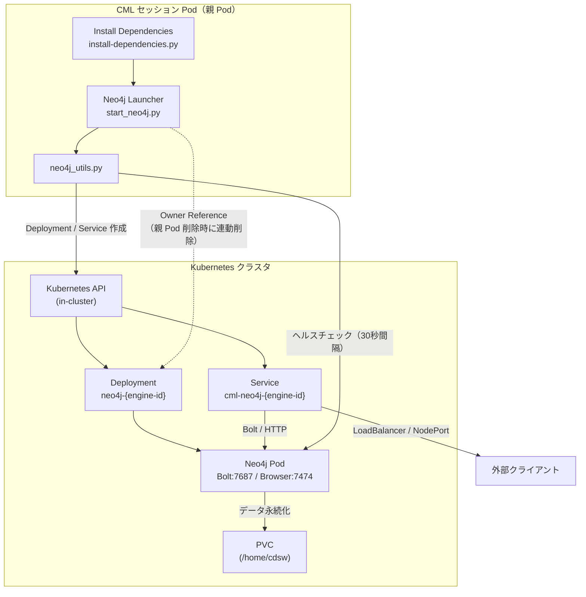

# Neo4j Launcher

Kubernetes 上で Neo4j を起動し、外部からアクセスできるようにするプロジェクトです。  
**Neo4j の起動・監視のみ** を行います。

## 概要

- Neo4j 2026.x を Kubernetes Deployment として起動
- APOC / Graph Data Science プラグインを有効化
- LoadBalancer / NodePort / ClusterIP で外部公開
- 起動後はヘルスチェックと自動再起動

## アーキテクチャ

CML のセッション Pod 内から Kubernetes API を呼び出し、別の Neo4j Pod をデプロイする構成です。



### 主なコンポーネント

| コンポーネント | 説明 |
|---|---|
| CML セッション Pod | `start_neo4j.py` を実行し、Neo4j の起動・監視を担当 |
| Deployment | Neo4j コンテナ（APOC / GDS プラグイン付き）を 1 レプリカで起動 |
| Service | Bolt（7687）と Browser（7474）をクラスタ内外に公開 |
| PVC | 親 Pod の `/home/cdsw` ボリュームを共有し、グラフデータを永続化 |

## セットアップ

### 環境変数（任意）

| 変数 | デフォルト | 説明 |
|------|-----------|------|
| `NEO4J_USERNAME` | `neo4j` | ユーザー名 |
| `NEO4J_PASSWORD` | `Neo4jPass1234` | パスワード。Configuration 画面で未設定の場合は `neo4j` / `Neo4jPass1234` を使用 |
| `NEO4J_ACCEPT_LICENSE_AGREEMENT` | `yes` | Neo4j Docker 起動に必須（未設定だと exit 1 で終了） |
| `NEO4J_SERVICE_TYPE` | `LoadBalancer` | Service タイプ (`LoadBalancer` / `NodePort` / `ClusterIP`) |
| `NEO4J_NODE_PORT_BOLT` | `30687` | NodePort（Bolt） |
| `NEO4J_NODE_PORT_HTTP` | `30474` | NodePort（Browser） |
| `NEO4J_IMAGE` | `neo4j:2026.07.1` | Neo4j イメージ |
| `NEO4J_PLUGINS` | `[]` | プラグイン（初回起動の安定性のため空がデフォルト。例: `["apoc"]`） |
| `NEO4J_MEMORY` | `4Gi` | Neo4j Pod のメモリ limit（4Gi 時は heap 2048m / pagecache 1024m を自動設定） |
| `NEO4J_HEAP_INITIAL` | （自動） | JVM ヒープ初期サイズを手動指定する場合 |
| `NEO4J_HEAP_MAX` | （自動） | JVM ヒープ最大サイズを手動指定する場合 |
| `NEO4J_PAGECACHE` | （自動） | ページキャッシュサイズを手動指定する場合 |
| `NEO4J_USE_PVC` | `false` | `true` で PVC に永続化。トラブル時は `false` で ephemeral 起動 |
| `NEO4J_STARTUP_TIMEOUT_SECONDS` | `1200` | 初回起動の待機時間（秒） |

### CML セッションのリソース

Launcher（親 Pod）と Neo4j Pod（子 Pod）は同じノード上で並行動作します。**CML のセッション / Application にはメモリ 8GB・CPU 2 以上** を割り当てることを推奨します。親 Pod が 4GB のままだと、子 Pod（`NEO4J_MEMORY=4Gi`）と合わせてノード上限を超え、OOMKilled になることがあります。

| Pod メモリ (`NEO4J_MEMORY`) | Heap | Page Cache |
|---|---|---|
| ≤ 2Gi | 512m | 256m |
| 4Gi | 1280m | 512m |
| > 5Gi | 自動スケール | 自動スケール |

### AMP タスク

1. **Install Dependencies** — `kubernetes`, `neo4j` パッケージをインストール
2. **Neo4j Launcher** — Neo4j を起動し、接続情報をログとステータスページに出力

アプリケーションは CML のヘルスチェック要件を満たすため、`CDSW_APP_PORT` で `/health` を公開します。接続情報は `/launcher` に表示されます。Status が **running** になると、Neo4j Browser から接続できます。

**Neo4j Browser** はステータスページの **Open Neo4j Browser**（`/browser/`）から開いてください。接続画面ではプロトコルに `https://` を選び、**HTTP API Connect URL**（例: `https://neo4j-launcher-<engine-id>.<domain>/`）をそのまま入力してください。

## 接続方法

アプリケーション起動後、ログに接続情報が表示されます。

```
=== Neo4j Connection Info ===
Username: neo4j
Password: Neo4jPass1234
Internal Bolt URI: bolt://cml-neo4j-<engine-id>.<namespace>:7687
Internal Browser:  http://cml-neo4j-<engine-id>.<namespace>:7474
External Bolt URI: bolt://<external-host>:7687
External Browser:  http://<external-host>:7474
=============================
```

### ClusterIP の場合

クラスタ外からアクセスするには port-forward を使用します。

```bash
kubectl port-forward svc/cml-neo4j-<engine-id> 7474:7474 7687:7687
```

- Browser: http://localhost:7474
- Bolt: bolt://localhost:7687

## ディレクトリ構成

```
neo4j-launcher/
├── 0_session-install-dependencies/   # 依存関係インストール
├── 1_start-neo4j/                  # Neo4j 起動スクリプト
├── utils/
│   └── neo4j_utils.py              # K8s デプロイ・接続ユーティリティ
└── NOTICES/                        # サードパーティライセンス
```

## ライセンス

サードパーティソフトウェアのライセンス情報は `NOTICES/` を参照してください。
